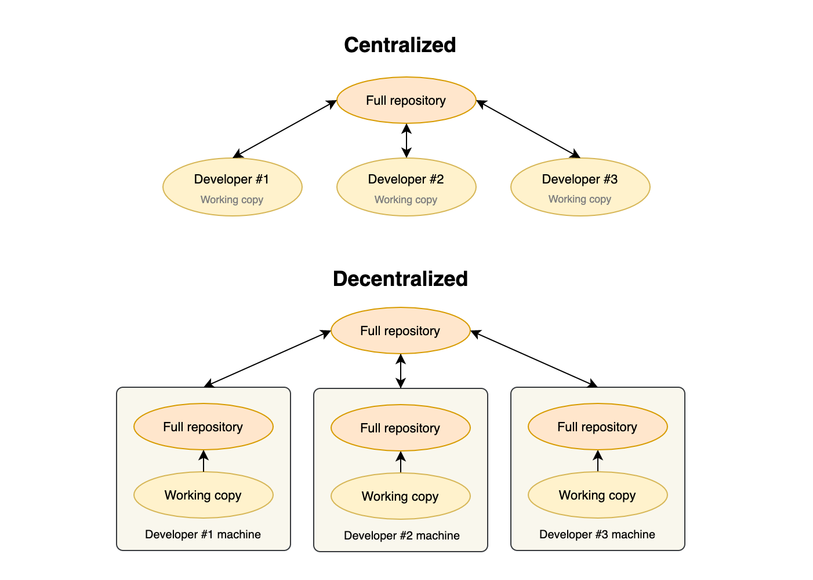
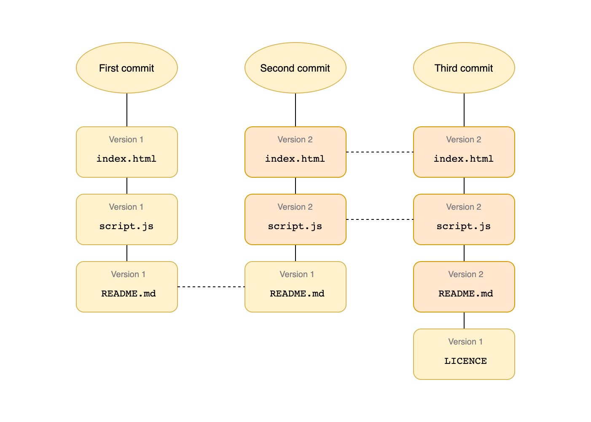
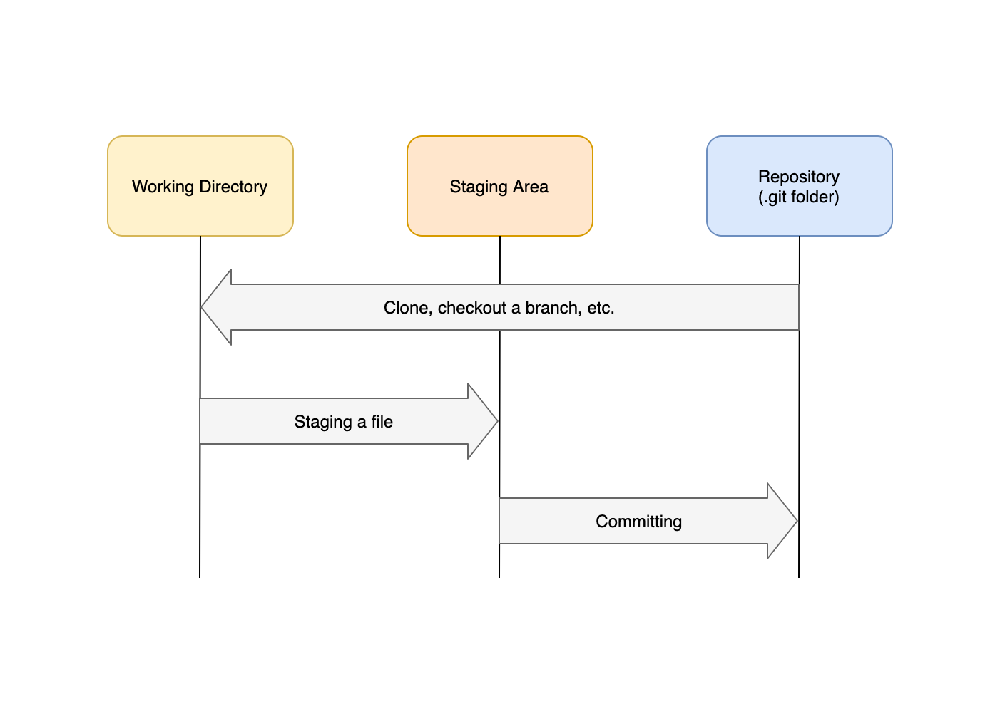

Git is a free and open-source Distributed Version Control System (DVCS) initially created by Linus Torvalds in 2005 following the [BitKeeper controversy](https://lwn.net/Articles/130746/) after none of the existing systems met his needs. Because Linus intended to use it for the Linux Kernel development, Git was designed to take into account performance, distribution, and safeguards against data loss. Fast-forward 16 years later and it is the de facto Version Control System (VCS) for software and an indispensable tool for every Software Engineer.

> You can never understand everything. But, you should push yourself to understand the system.
>
> \- Ryan Dahl (Creator of Node.js)

Git has excellent documentation and even a [free book](https://git-scm.com/book/en/v2), but most people don't bother learning about it and instead only try to memorize the commands they use in their day-to-day work or rely only on GUIs that make everything seem magical, this leads to them peeling their hair in frustration as they start facing all kind of issues (looking at you, merge conflicts!). While one can certainly use Git with just basic knowledge, knowing how it all works under the hood will give you extra confidence and will make you a distinguishable engineer.

In this series, we will be going down the rabbit hole to try and demystify how Git works internally, and at the end, you'll come to know that **Git is not magic**, its design model is what made it the powerful tool that we all love and hate (not anymore) today, so we must understand that before going any deeper.

*PS: This is not a beginner's guide so a basic knowledge of Git is required*

## Git is Distributed

We hear about Git being a DVCS all the time, but do you really know what that means? Before we understand the meaning of distributed, let's first talk about Centralized VCSs (CVCS).

In CVCSs, nothing is stored locally, so all actions depend on a single remote repository. To commit code, view the logs, or compare your changes with other people's, you'll need to be online. Being centralized also means having a single point of failure. If the repository is deleted by mistake or the disks on the server crash, everything will be lost.

Now let's go back to DVCSs, when you do a `git clone`, Git downloads the whole history of the repository and stores it in – its local database – the `.git` folder. This means that you can still commit your work locally when you're on an airplane or when the internet is down and push it to a remote repository when you're back online, and essentially all developers who cloned this repository now have a backup in their machine. This also has the benefit of being extremely fast, as most operations don't need to reach for a server.

## Git Takes Snapshots

This is one of the key design differences between Git and other VCSs. These other systems store information as an initial file and the changes (diffs) made to it over time, Git follows a different approach and instead takes a snapshot (think a picture) of your whole files when you do a commit, now you might think that's expensive if you have a lot of files, but as we'll come to see in the next part, Git is smart enough to not store the same file twice if it hasn't changed and instead references the previous version of that file.

The important point to get from this is that Git acts like a mini filesystem, but with superpowers.

## Integrity is Built-in

Before Git stores any file, it computes a 40 character long hexadecimal string known as a hash that serves as an identifier. To accomplish this, Git uses a popular hashing algorithm called [SHA-1](https://en.wikipedia.org/wiki/SHA-1). We'll see how it does it in the next part, but it will look similar to this: `a0b65939670bc2c010f4d5d6a0b3e4e4590fb92b`. This makes it impossible for your files to change or get corrupted without Git knowing about it. Note that SHA1 is considered insecure nowadays, especially after Google released [SHAttered](https://shattered.it) –the first practical collision attack against SHA1– in 2017 and [Git is planning to transition to SHA-256](https://github.com/git/git/blob/master/Documentation/technical/hash-function-transition.txt).

## File States in Git

All files in a Git repository can either be **modified**, **staged**, or **committed**. Your files go into the first state when git detects that it has changed from the last version (remember the hash?) stored in its database. To save this change, you'll need to commit it, but first, you have to tell Git which changes you want to "prepare" for the next commit. This is accomplished by adding them to the staging area. Once committed, Git takes a snapshot of your files and saves it permanently in its database.

## Conclusion

This was a short introduction to this series where we will uncover the nitty-gritty details behind Git internals. We started by first understanding the key aspects of the Git design model. In the next part, we'll see how this all comes down together as we discuss Git Objects.
